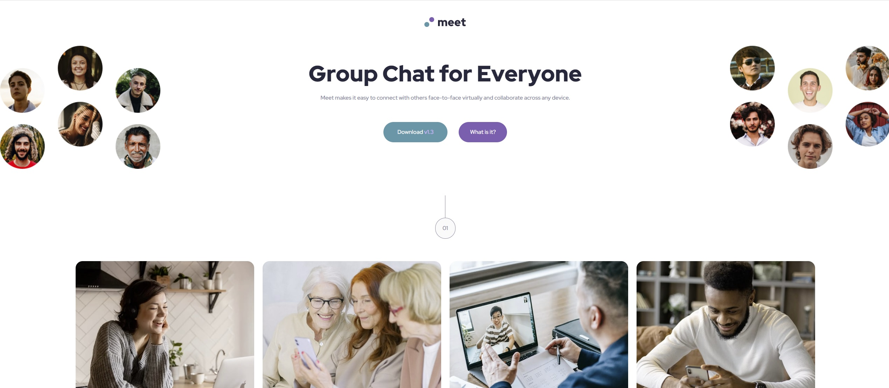

# Frontend Mentor - Meet landing page solution

This is a solution to the [Meet landing page challenge on Frontend Mentor](https://www.frontendmentor.io/challenges/meet-landing-page-rbTDS6OUR). Frontend Mentor challenges help you improve your coding skills by building realistic projects. 

## Table of contents

- [Overview](#overview)
  - [The challenge](#the-challenge)
  - [Screenshot](#screenshot)
  - [Links](#links)
- [My process](#my-process)
  - [Built with](#built-with)
  - [What I learned](#what-i-learned)
  - [Continued development](#continued-development)

**Note: Delete this note and update the table of contents based on what sections you keep.**

## Overview

### The challenge

Users should be able to:

- View the optimal layout depending on their device's screen size
- See hover states for interactive elements

### Screenshot

### Links

- Solution URL: https://github.com/Nazemrap/meetLanding
- Live Site URL: [Add live site URL here](https://your-live-site-url.com)

## My process
Set Colors and font familly in the :root
setting h1--6, p for each screnn resolutions.
Start with the mobile layout and going toward desktop size. 

### Built with

-HTML
-CSS

Via VCS

### What I learned

 - First time using Grid, simple but it's a first approach. 
 - Also learned on the way a little bit about FlexGrid. Couln't use it but for a next time maybe
 - First time unsing :root and var() method. 
 
### Continued development

Use this section to outline areas that you want to continue focusing on in future projects. These could be concepts you're still not completely comfortable with or techniques you found useful that you want to refine and perfect.

